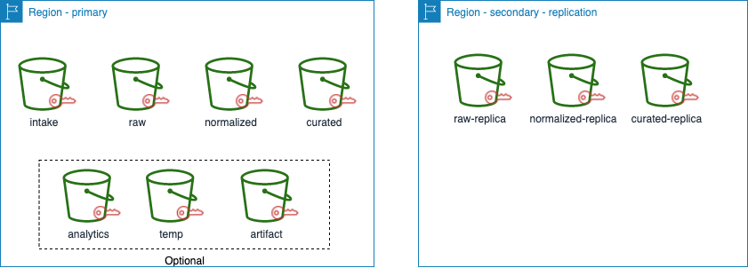
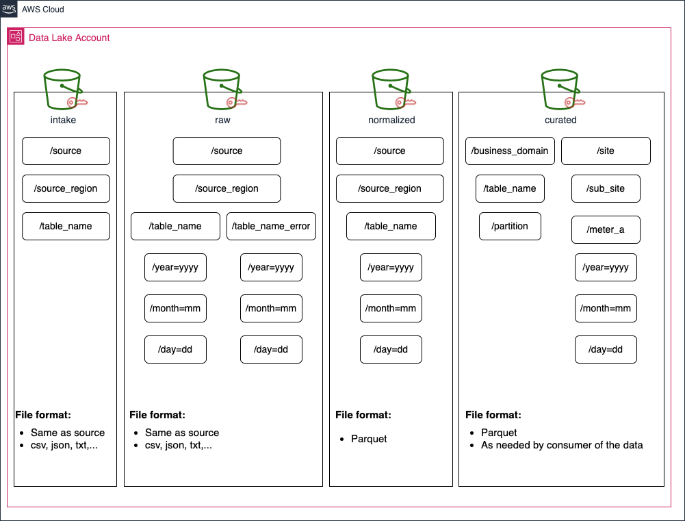

# APG Data Lake Storage Layer Eamples
Sample code showing how to implement the data lake layer standardization to reduce the data management cost and speed up the build phase. We recommend the use of four data layers in a data lake and that each layer uses a separate Amazon Simple Storage Service (Amazon S3) bucket.  The following list describes the four data layers of a data lake:

- Intake layer: Is a transient zone, where data is initially loaded and basic data quality checks are performed by data ingestion processes. The intake layer provides a centralized and managed entry point for example on-premises and third party (e.g. Weather) data to be processed in the data lake. A well defined ingestion process using an intake layer is a critical feature of a well governed data lake in order to prevent data lake from turning into a data swamp. 

- Raw layer: Contains a copy of the source data in the source format (unstructured, structured and semi-structured). Data stored in this layer is as is, without any changes, acts as a golden copy to downstream processes. Raw layer sometime also referred to as archive, since it enables the capability of replaying data pipelines in case data needs to be reconstructed in downstream layers. The raw layers also contains data that failed to be processed by the ingestion process into the Normalized layer, but with appropriate security tags applied.

- Normalized layer: Contains intermediate processed data optimized for downstream transformation processes. Data in this layer has basic transformations and standard technical attributes, for example data may be processed to standardize data types, decimal precision, time zones, and use common Apache Parquet data format. Data in this layer has been validated and the metadata is stored in a table in the AWS Glue Data Catalog, thus queryable through a SQL engine such as Amazon Athena. Since data at this layer does not have business logic it is easier to keep up with upstream application data model changes. An emerging benefit of this layer is reduction of data wrangling time of the data science teams. 

- Curated layer: Contains data that is organized for analytics/user consumption and may contain business logic. Analytics consumption transformations include schema changes for both user/report query performance  and use case specific data models. Data is considered to be trusted and production grade. The use of views in this layer is highly recommended to abstract the business analysts from underlying changes in data. 
Depending on your compliance requirements you might need to replicate some of the layers to another region.

All layers above should utilize protect sensitive information by tagging data according to limit access to different users and persona within the data lake. 

Besides the four S3 buckets needed for above layers, following list describes additional S3 buckets used in the data lake:

- Temp S3 Bucket: Used for temporary storage needed by AWS services, for example Amazon Athena. Recommended to create a prefix for each service that needs temporary storage and secure with highest standards.
- Artifact S3 Bucket: Use to store compiled code artifacts and/or configuration files. Customer with matured DevOps practice may choose artifact repository service AWS Code Artifact and AWS Configuration.  
- Analytics S3 Bucket: An area where business analysts and data scientists can unlock new value and insights from the data in the data lake. In this layer, users may have write permissions in order to create tables to produce prototypes. It’s important to highlight, no production workloads rely on this layer. Customers using data mesh architecture may use another account for analytics & data scientist workloads.

## Scope
This project only includes sample code to standarize data lake storage. Excludes any CI/CD processes. 

## Requirements & Assumptions
1. Assumes you are using AWS multi-account best practices, for example dev and prod are two different accounts.
1. AWS CLI is installed.
1. AWS profile of the deployment account have been configured.
1. Bash scripts are used to deploy the code, windows users should try Git Bash.
1. Install https://github.com/stelligent/cfn_nag to identify insecure infrastructure (optional).

### CloudFormation Security Scan (optional)
find . -name '*.yaml' -exec cfn_nag_scan --input-path {} \;

## Decision Log
| Number | Title                           | Description                                                                                                                                                                                                  |
|:-------|:--------------------------------|:-------------------------------------------------------------------------------------------------------------------------------------------------------------------------------------------------------------|
| 1      | Role Name Convention            | ${pOrganizationName}-${pFrameworkPrefix}-${AWS::Region}-${pEnvironment}-${descriptive role name}"                                   |
| 2      | Resource Policy Name Convention | ${pOrganizationName}-${pFrameworkPrefix}-${AWS::Region}-${pEnvironment}-${descriptive policy name}"                                               |
| 3      | SSM - Parameter Name Convention | Parameters with prefix "/account/" apply to the entire account. Parameters with prefix "/account/<framework-prefix>/" apply to application identified with prefix. |
| 4      | Single KMS key                  | Same KMS key is applied to encrypt all the layers. If required by compliance different keys can be used. |

## Architecture

## Deployment

### Pre-Deployment
Update the following parameter files (dev, test, prod, ...).

- ./source_cf/dl_foundation/ssm-lambda/parameters-*.json

Update the following parameters in the parameter files.
- pEnvironment - Environment of the account (dev, test, prod, ...)
- pOrganizationName - Organization Name
- pFrameworkPrefix - Prefix to identify this data lake/application within the organization.
- pLogsRetentionInDays - Default number of days logs are retained by CloudWatch logs. There is no grantee that CF templates uses this parameter. It is advinced it is used.
- pReplicaToSecondaryRegion - Set "T" if replicating to secondary region
- pReplicaDestRegion - Destination region

**You can execute the below commands to deploy the storage layers.
    
./source/dl-foundation/deploy.sh -f <framework_prefix/app_prefix> -e <deployment environment> -r <aws region> -p <aws profile>

Parameter "-p" aws profile is optional parameter.

## Storage Organization Recomendation

## Security

See [CONTRIBUTING](CONTRIBUTING.md#security-issue-notifications) for more information.

## License

This library is licensed under the MIT-0 License. See the LICENSE file.

